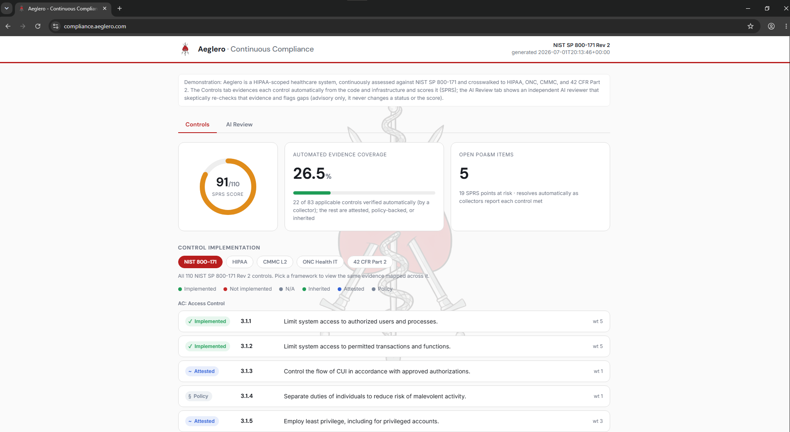
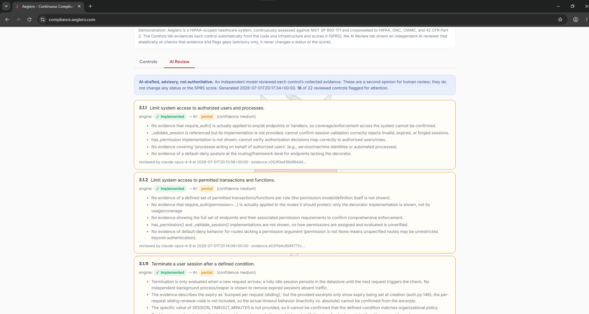
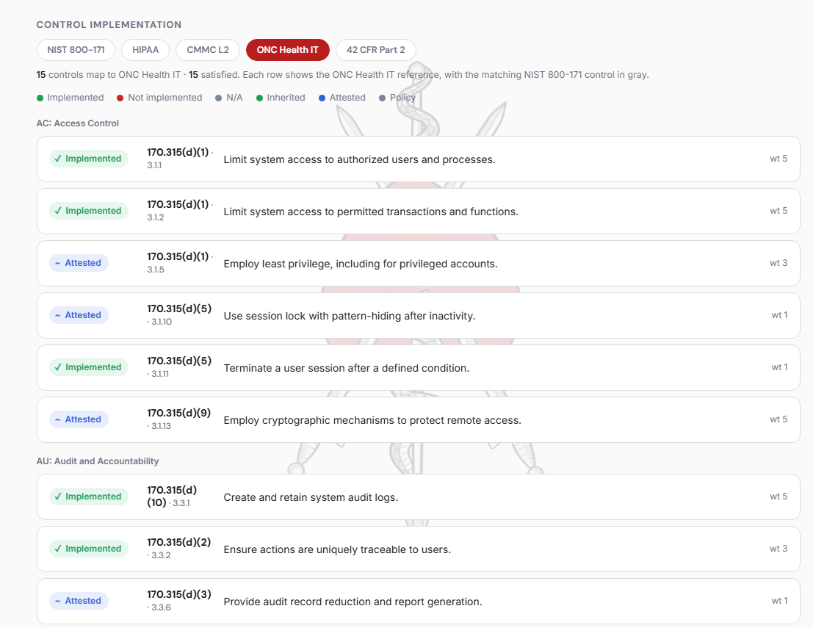
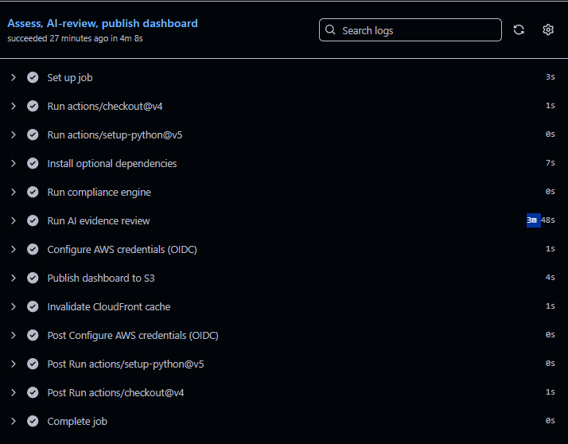

# Aeglero Continuous Compliance

A continuous controls monitoring subsystem for the Aeglero EMR. It assesses the running
system against NIST SP 800-171 Rev 2, generates the two artifacts an assessor works from
(a System Security Plan and a Plan of Action and Milestones), computes an SPRS score, and
crosswalks every control to HIPAA, ONC Health IT, CMMC, and 42 CFR Part 2. It runs on a
schedule, so compliance posture is measured continuously rather than reconstructed in the
weeks before an audit.

The approach is "compliance as code". Evidence is gathered by small, testable collectors
that read the actual application source, infrastructure, and CI configuration, so each
control status links back to the specific line of code or config that supports it.

The live dashboard at [compliance.aeglero.com](https://compliance.aeglero.com):

<p align="center">
  
</p>

## What it produces

One command runs the whole pipeline and writes four things:

- `output/status.json` is a machine-readable scorecard: every control with a status, a
  disposition, cited evidence, and a SHA-256 provenance hash.
- `output/SSP.md` is a System Security Plan: a per-control implementation statement with
  linked evidence.
- `output/POAM.md` and `output/POAM.csv` are the Plan of Action and Milestones: the open
  items with milestone dates.
- `dashboard/data.js` feeds `dashboard/index.html`, a self-contained page with an SPRS
  gauge, a browsable control list, and a framework switcher (the Controls tab), plus a
  read-only AI Review tab fed by `dashboard/ai_review.js` (see AI evidence review below).
  The page is published live at https://compliance.aeglero.com.

## How it works

```
collectors  ->  catalog  ->  scorer  ->  generators
(evidence)     (controls)    (SPRS)      (dashboard, SSP, POA&M, JSON)
```

1. Collectors in `collectors/` gather evidence for specific controls. Each returns
   findings with a status, an assessment method (Examine or Test, per NIST SP 800-171A),
   cited evidence, and a hash of that evidence.
2. The catalog in `catalog/controls.json` (built by `catalog/build_catalog.py`) defines
   all 110 NIST 800-171 Rev 2 controls, their SPRS weight, their disposition type, and
   their cross-framework mappings.
3. The scorer in `scorer.py` computes the SPRS score and automation coverage from the
   merged findings and the catalog.
4. The generators in `generate_docs.py` render the SSP, the POA&M, and the dashboard feed.

Run it:

```
python compliance/run.py
```

The core engine uses only the Python standard library. The single optional collector that
queries a live AWS account uses boto3 (see `requirements.txt`) and is off by default.

## Control dispositions

Not every control can, or should, be proven by scanning code. Each control carries a
disposition that states plainly how it is satisfied:

| Disposition | Meaning | Count |
|---|---|---|
| Implemented (automated) | Proven now by a collector that reads source, infra, or CI | 22 |
| Attested | Implemented in the application; a collector for it is a roadmap item | 39 |
| Policy | Satisfied by an organizational policy or process document | 17 |
| Inherited | Provided by the cloud platform (AWS), evidenced by its attestations | 12 |
| Not applicable | Out of scope for this system, with a stated rationale | 15 |
| Not met (gap) | Required but not yet in place (training and personnel policies), tracked in the POA&M | 5 |

Current posture is SPRS 91 of 110, with about 27 percent (22 of 83 applicable controls)
verified automatically. That automated share is designed to grow over time: adding a
collector for an Attested control moves it to Implemented and raises the coverage number.

## Collectors

| Collector | Method | Area |
|---|---|---|
| `audit_chain` | Examine | Audit generation, traceability, tamper-evident hash chain (3.3.x) |
| `access_control` | Examine | Authentication, RBAC, MFA (3.1.x, 3.5.3) |
| `identity_hardening` | Examine | Session, credential, and least-privilege hardening (3.1.8, 3.1.11, 3.5.7) |
| `flaw_remediation` | Examine | Vulnerability scanning and merge gating in CI (3.11.2, 3.14.1) |
| `crypto_config` | Examine | Encryption in transit and at rest, read from Terraform (3.13.x) |
| `network_config` | Examine | Boundary protection and subnet isolation, read from Terraform (3.13.1, 3.13.5, 3.13.6) |
| `self_assessment` | Examine | The engine itself satisfies the assessment family (3.12.x) |
| `aws_live` | Test | Optional live check of the running AWS account (opt-in) |

Adding a collector is the primary extension point. Implement a `Collector` subclass that
returns findings for one or more controls, then register it in `collectors/__init__.py`.

## AI evidence review

An optional, advisory reviewer (`ai_review.py`) gives each automated control a second,
independent read. For a control, it sends the collected evidence and the exact code
excerpts that evidence cites to a language model, which judges whether the evidence
supports the control and flags gaps. It is advisory only: it never changes a control
status or the SPRS score. A payload allowlist and a secret scrubber run before any model
call, so whole files, credentials, and secrets are never sent.

The reviewer is opt-in and off by default. A dry run (`--dry-run`) builds and scrubs the
payloads and prints exactly what would be sent, with no API call; a live run needs an API
key. Its output feeds the read-only AI Review tab on the dashboard, which shows the engine
verdict next to the AI verdict for each control and surfaces any disagreements. A separate
narrative mode drafts SSP implementation statements that a human must approve (`--approve`)
before the generator will use them.

The threat model, data-minimization design, and provider governance for this feature are
documented in [docs/ai-evidence-review.md](docs/ai-evidence-review.md).

The AI Review tab, showing the engine verdict beside the AI verdict and any disagreements:

<p align="center">
  
</p>

## Frameworks

Controls are assessed against NIST 800-171 and crosswalked to other frameworks, so a
single piece of evidence can satisfy several at once. The dashboard switches between these
views, showing each control by its framework reference next to its NIST 800-171 control.

| Framework | Mapped controls |
|---|---|
| NIST SP 800-171 Rev 2 | 110 |
| CMMC Level 2 | 110 |
| HIPAA Security Rule | 36 |
| ONC Health IT Certification | 15 |
| 42 CFR Part 2 | 6 |

Switching the dashboard to another framework re-labels each control by that framework's reference:

<p align="center">
  
</p>

## Continuous operation

A scheduled GitHub Actions workflow (`.github/workflows/compliance.yml`) re-runs the
assessment daily, uploads the refreshed evidence as an artifact, and fails the run if the
SPRS score falls below a threshold or a control regresses. The regression and threshold
logic lives in `check_drift.py`. A second workflow runs the optional live AWS checks
through a read-only role assumed via GitHub OIDC, so no cloud credentials are stored.

A third workflow (`.github/workflows/dashboard-deploy.yml`) runs weekly: it re-runs the
assessment and the AI review, then publishes the refreshed dashboard to the live site at
https://compliance.aeglero.com (a private S3 bucket behind CloudFront) and invalidates the
CDN cache. It uses a separate write-scoped role assumed via GitHub OIDC, so again no cloud
credentials are stored. The hosting and roles are described in
[../infra/README.md](../infra/README.md).

A weekly `dashboard-deploy` run assessing, AI-reviewing, and publishing the site end to end:

<p align="center">
  
</p>

## Layout

```
compliance/
  run.py                 pipeline entry point
  scorer.py              SPRS scoring
  generate_docs.py       SSP, POA&M, and dashboard feed
  check_drift.py         drift detection and score gate
  ai_review.py           optional advisory AI evidence reviewer (opt-in)
  catalog/
    build_catalog.py     builds controls.json
    controls.json        the 110-control catalog (generated)
  collectors/            evidence collectors
  dashboard/             self-contained dashboard (index.html, data.js, ai_review.js)
  docs/
    ai-evidence-review.md  AI reviewer design, threat model, and governance
  output/                generated artifacts (regenerated each run)
  references/
    SOURCES.md           authoritative source for every framework and mapping
```

## Scope and caveats

The control dispositions, SPRS weights, and cross-framework mappings are drafted and
should be verified against the authoritative sources listed in `references/SOURCES.md`
before being relied upon.
